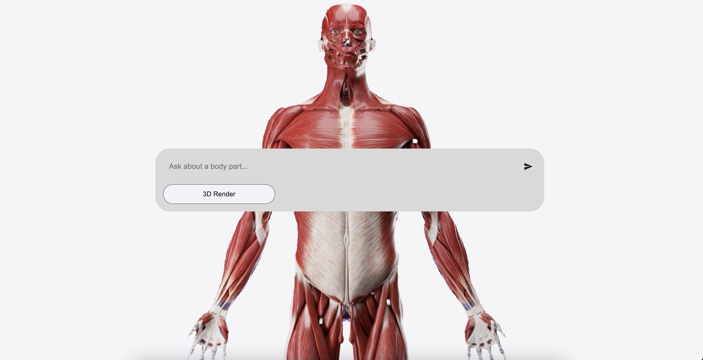
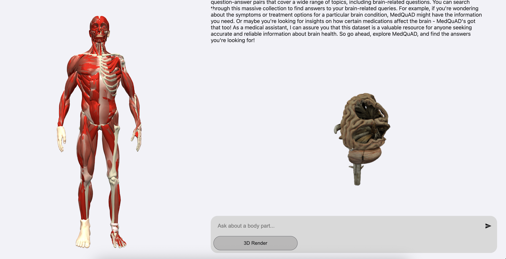

# 🧠 **AI Health Assistant**

**AI Health Assistant** is a **web-based platform** designed for **interactive exploration** of **human anatomy** through a **chat interface** and **advanced 3D visualizations**.

Hosted at: [https://github.com/Bishal-Kharel/aiinhealthcare-flask-platform](https://github.com/Bishal-Kharel/aiinhealthcare-flask-platform)

It enables users to **ask questions** about **body parts**, receive **AI-generated responses** streamed in **real-time** via **Server-Sent Events (SSE)**, and interact with **3D models** — including **full-body** with dynamic highlighting and **individual anatomical structures**. Built with **Flask**, **OpenAI**, **Chroma**, **Redis**, and **Three.js**, it delivers an **engaging educational experience**.

---

## ✨ **Key Features**

- **Real-Time Response Streaming**  
  Utilizes **Server-Sent Events (SSE)** to stream **AI responses** and **3D model metadata** dynamically.

- **Full-Body 3D Model with Highlighting**  
  Highlights **queried body parts** (e.g., **heart**, **liver**) in the **full-body model** for **intuitive learning**.

- **Individual 3D Models**  
  **Specific anatomical models** appear in the **chat interface** when **3D rendering** is enabled.

- **Interactive Chat Interface**  
  Includes **initial**, **standard**, and **expanded views** for **flexible user interaction**.

- **Contextual AI Responses**  
  Uses **MedQuAD-based document store** for **medically accurate information**.

- **Response Caching**  
  Boosts **performance** by caching **responses** using **Redis**.

- **Responsive Design**  
  Optimized for **all screen sizes** and **devices**.

---

## 🖼 **Screenshots**

- **Initial Prompt Screen**  
  Displays the **intro video**, **input field**, and **toggle** for **3D model rendering**.  
  

- **Chat Interface with 3D Model**  
  Shows **full-body model** highlighting **queried body parts** with **individual 3D models** in **messages**.  
  

---

## ✅ **Prerequisites**

- **Python** 3.8 or higher
- **Redis** server
- **Web browser** with **WebGL** support
- **API keys** for:
  - **OpenAI**
  - **Sketchfab**

---

## 🛠 **Installation**

### **1. Clone the Repository**

```bash
git clone https://github.com/Bishal-Kharel/aiinhealthcare-flask-platform.git
cd aiinhealthcare-flask-platform
```

### **2. Install Dependencies**

```bash
pip install flask openai langchain-openai langchain-chroma redis python-dotenv requests
```

OR

```bash
pip install -r requirements.txt
```

### **3. Configure Environment Variables**

Create a `.env` and add your **API keys**:

```plaintext
OPENAI_API_KEY=<your_openai_api_key>
SKETCHFAB_API_TOKEN=<your_sketchfab_api_token>
REDIS_HOST=localhost
REDIS_PORT=6380
REDIS_DB=0
```

### **4. Ingest Documents**

Place **medical documents** (e.g., **MedQuAD XML**, **PDF**, **CSV**) in the `docs/` directory, then run:

```bash
python scripts/ingest.py
```

### **5. Fetch 3D Models**

Download **anatomy models** from **Sketchfab**, including the **full-body model** (`ecorche_-_anatomy_study`):

```bash
python scripts/sketch_fetcher.py
```

### **6. Run the Application**

```bash
python app.py
```

Access at `http://localhost:5000`.

---

## 🚀 **Usage**

### **1. Initial Prompt**

- Enter a **query** (e.g., "What is the function of the heart?") in the **homepage input field**.
- Toggle **3D Render** to enable/disable **3D model display** in **chat messages**.
- Submit to transition to the **chat interface**.

### **2. Chat Interface**

- View **AI responses** streamed in **real-time** via **SSE**.
- Switch between **standard** and **expanded chat views**.
- Collapse **expanded view** to return to **standard view**.

### **3. 3D Visualization**

- **Full-Body Model**: Displayed on the left, highlights **body parts** (e.g., **heart**, **liver**) based on the **query**.
- **Individual Models**: Appear in **chat messages** if **3D rendering** is enabled.
- Rotate and zoom **models** using **mouse controls**.

---

## 🌟 **Full-Body 3D Model and Body Part Highlighting**

The **full-body 3D model**, powered by **Three.js** and loaded from `static/assets/3d/ecorche_-_anatomy_study/scene.gltf`, is a **core feature**. Key aspects include:

- **Dynamic Highlighting**: Queries referencing **body parts** (e.g., "**heart**") highlight the corresponding **mesh** in **red**. Supported parts include **heart**, **liver**, **skeleton**, and more, defined in a **mesh mapping**.
- **Interactive Controls**: Users can **rotate** and **zoom** the model using **OrbitControls** for an **immersive experience**.
- **Real-Time Updates**: **Body part highlights** update every **500ms** based on **query context**.
- **Responsive Rendering**: Adjusts to **container size** for **optimal display** across **devices**.

**Example**:

- **Query**: "Explain the liver’s role in digestion."
- **Response**: **AI** streams an **explanation** via **SSE**, the **full-body model** highlights the **liver mesh**, and a **liver model** (`static/assets/3d/liver/scene.gltf`) appears in the **chat** if **3D rendering** is enabled.

---

## 📂 **File Structure**

```
aiinhealthcare-flask-platform/
├── .gitignore
├── README.md
├── app.py
├── ai_routes.py
├── scripts/
│   ├── ingest.py
│   └── sketch_fetcher.py
├── docs/
│   ├── medquad/
│   │   ├── MedQuAD_1.xml
│   │   ├── MedQuAD_2.xml
│   │   └── ...
│   └── other_document_formats/
│       ├── sample.pdf
│       ├── sample.csv
│       └── sample.md
├── static/
│   ├── assets/
│   │   ├── 3d/
│   │   │   ├── ecorche_-_anatomy_study/
│   │   │   │   ├── scene.gltf
│   │   │   │   └── textures/
│   │   │   ├── brain/
│   │   │   │   ├── scene.gltf
│   │   │   │   └── textures/
│   │   │   └── ...
│   │   └── videos/
│   │       └── intro1.mp4
│   ├── css/
│   │   ├── chatInput.css
│   │   ├── chatMessages.css
│   │   ├── introVideo.css
│   │   └── threeDModelFull.css
│   ├── js/
│   │   ├── chatInput.js
│   │   ├── chatMessages.js
│   │   ├── dynamic3dModel.js
│   │   └── threeDModelFull.js
│   └── screenshots/
│       ├── screenshot1.png
│       └── screenshot2.png
├── templates/
│   └── index.html
└── chroma_store/
    ├── [Chroma vector store files]
```

---

## 🛠 **Troubleshooting**

- **No Response**: Verify **OpenAI API key** and **network connectivity**.
- **3D Models Not Loading**: Ensure `static/assets/3d/` contains **GLTF files**, including `ecorche_-_anatomy_study`.
- **Body Part Not Highlighted**: Check if the **queried body part** is supported in `threeDModelFull.js` **mesh mapping**.
- **SSE Issues**: Confirm **browser** supports **EventSource**; review **server logs**.
- **Redis Errors**: Ensure **Redis server** is running and configured in `.env`.

---

## 🤝 **Contributing**

**Contributions** are welcome! To contribute:

1. Fork the **repository**.
2. Create a **feature branch** (`git checkout -b feature/YourFeature`).
3. Commit **changes** (`git commit -m "Add YourFeature"`).
4. Push to the **branch** (`git push origin feature/YourFeature`).
5. Open a **pull request**.

---

## 📜 **Licenses**

### **Project License**

This project is licensed under the **MIT License**. See the `LICENSE` file for details.

### **3D Model License: Ecorche - Anatomy Study**

- **Title**: Ecorche - Anatomy Study
- **Source**: [https://sketchfab.com/3d-models/ecorche-anatomy-study-e402d3d541eb4b199c57d5410f5d3c57](https://sketchfab.com/3d-models/ecorche-anatomy-study-e402d3d541eb4b199c57d5410f5d3c57)
- **Author**: Beatriz Gomez Santamaria ([https://sketchfab.com/BeatrizGomez](https://sketchfab.com/BeatrizGomez))
- **License**: CC-BY-4.0 ([http://creativecommons.org/licenses/by/4.0/](http://creativecommons.org/licenses/by/4.0/))
- **Requirements**: Author must be credited. Commercial use is allowed.

**Credit**:  
This work is based on "Ecorche - Anatomy Study" ([https://sketchfab.com/3d-models/ecorche-anatomy-study-e402d3d541eb4b199c57d5410f5d3c57](https://sketchfab.com/3d-models/ecorche-anatomy-study-e402d3d541eb4b199c57d5410f5d3c57)) by Beatriz Gomez Santamaria ([https://sketchfab.com/BeatrizGomez](https://sketchfab.com/BeatrizGomez)) licensed under CC-BY-4.0 ([http://creativecommons.org/licenses/by/4.0/](http://creativecommons.org/licenses/by/4.0/)).

### **Dataset License: MedQuAD**

- **License**: Creative Commons Attribution 4.0 International (CC-BY-4.0) ([http://creativecommons.org/licenses/by/4.0/](http://creativecommons.org/licenses/by/4.0/))
- **Requirements**: Attribution to the original creators is required. Commercial use is permitted, and modifications are allowed if credited appropriately.
- **Source**: MedQuAD dataset used for medical question-answering.
- **Note**: The dataset is provided "as-is" with no warranties. Users must credit the original creators when sharing or adapting the material.
